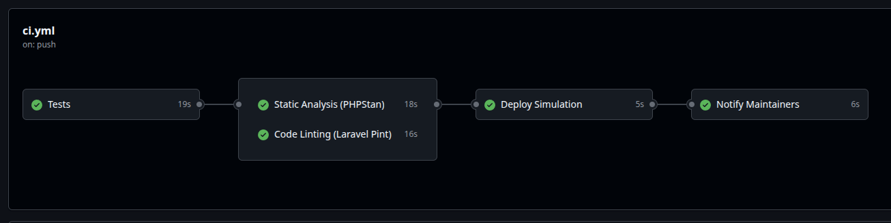
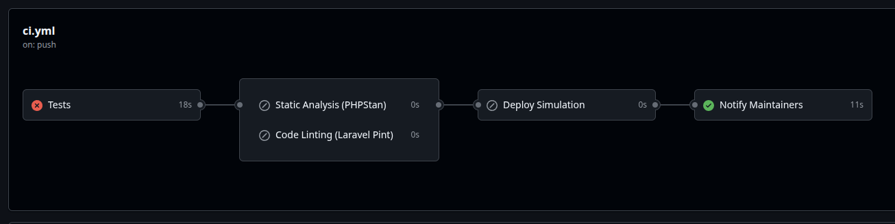

# Laravel CI/CD Pipeline

## Описание

Laravel приложение с автоматизированным CI/CD пайплайном на GitHub Actions.

**Репозиторий**: https://github.com/godofphonk/php

## Структура пайплайна

Пайплайн запускается автоматически при push или Pull Request в ветки: **master**, **development**, **uat**.

### Этапы выполнения:

#### 1. **Tests** (Тестирование)
- Запуск PHPUnit тестов
- Проверка покрытия кода (минимум 50%)
- **Gate**: Пайплайн падает если тесты не проходят или покрытие < 50%

#### 2. **Static Analysis** (PHPStan/Larastan)
- Статический анализ кода (уровень 4)
- **Gate**: Пайплайн падает при любой ошибке PHPStan

#### 3. **Linting** (Laravel Pint)
- Проверка стиля кода (PSR-12/Laravel)
- Режим: test (без автоисправления)
- **Gate**: Пайплайн падает при нарушении стандартов

#### 4. **Deploy Simulation** (Симуляция деплоя)
- Выполняется только при успехе всех предыдущих шагов
- Использует соответствующий `.env` файл для каждой ветки:
  - `master` → `.env.prod` (требует ручной аппрув)
  - `uat` → `.env.uat`
  - `development` → `.env.dev`

#### 5. **Notify** (Уведомления)
- Отправка Telegram уведомлений maintainers
- Содержит статус всех этапов пайплайна
- Выполняется всегда (даже при ошибках)

## Конфигурационные файлы

### `.env.dev` (Development)
### `.env.uat` (UAT/QA)
### `.env.prod` (Production)
### `.env.ci` (CI Pipeline)

